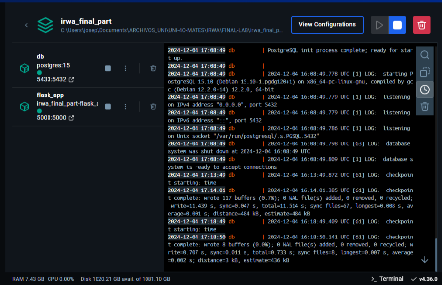
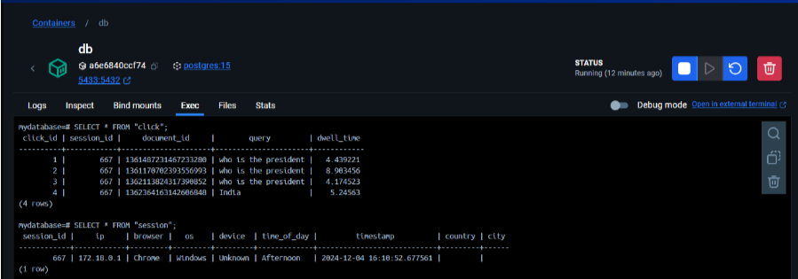
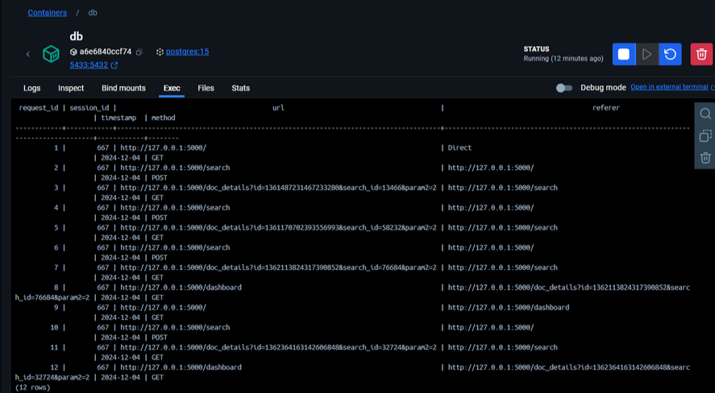

# Search Engine with Web Analytics
# IRWA Final Project

This project contains a Flask web app along with the necessary files to run it, as well as the corresponding PostgreSQL database.

## Starting the Web App
This web app is containerized using Docker and Docker Compose to simplify execution and ensure compatibility across multiple operating systems.

> Windows

1. Install Docker desktop
2. Run the following command in the root of your project (after restarting the terminal)
```bash
docker-compose up --build
```

> Linux
1. Install Docker Engine and Docker Compose
2. Run the following command in the root of your project (after restarting the terminal)
```bash
docker-compose up --build
```

The above command will start two connected containers: a web server running the application and a PostgreSQL database.

## Navigation
Once both containers are up and running, you can use Docker Desktop to monitor their status and ensure everything is functioning as expected.


After navigating through the website for some time, you can check the database tables by accessing the 'exec' section of the 'db' container. To do so, log in to the PostgreSQL CLI using the following command:
```bash
psql -U postgres -d mydatabase
```
Once inside the postgre cli you can check the state of the tables.


